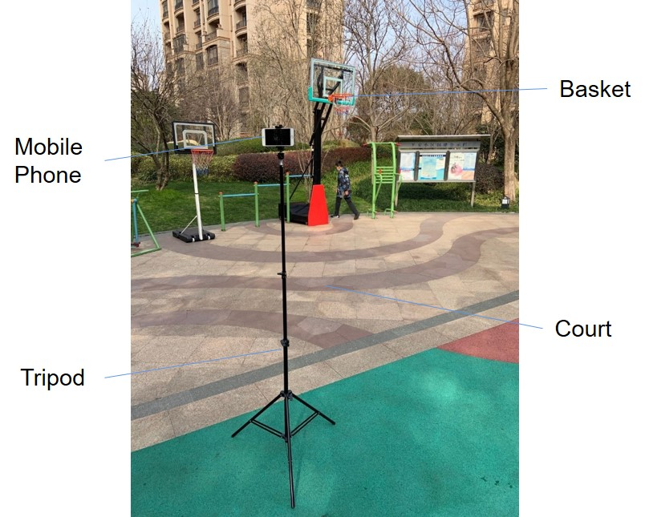

# Basketball Goal Detection App 
iOS App using to identify basketball goals

GitHub Link: (https://github.com/jadongao/basketball)

# 1.What kinds of things is this work?
Basketball players need daily training, but currently they can only manually record the score themselves, which is very inconvenient. This project is a basketball goal detection software that can run on mobile phones. Basketball players carry their phones and tripods with them and place them on the side of the basketball court to automatically recognize and score shooting. After extensive experiments and optimization, it is possible to automatically and accurately identify whether a shot is scored or not. For basketball player who want to improve their abilities, it is very convenient to use data more efficiently to improve their basketball skills.

# 2.How to characterize / categorize this work?

Basketball Shooting Recognition, Goal Detection, Scoring, iOS, Opencv

# 3.Briefly description of this work

For basketball player, there is currently a lack of a software system suitable for daily training. One of the key items is to calculate the shooting rate of players. Without easy-to-use tools, it is not convenient to improve the abilities of basketball enthusiasts and provide players with feedback.
Existing similar systems usually use professional software such as MATLAB, and also require specific hardware, making it difficult to popularize.

This App mainly recognizes changes in the basket. If a ball enters the recognized area, the program will display a "ball in" symbol and count the total score. This program requires the use of an open-source computer vision library called OpenCV. First, import the video, then use OpenCV to monitor the basket area, observe the changes in that area, and identify whether the basketball is in the basket.
In the design, it is necessary to consider using a mobile phone as a platform for image recognition, and the software should be simple and not too resource intensive. The phone should be able to work independently during runtime.

<div align=center> </div>

Basketball player carry their phones and tripods with them and place them on the side of the basketball court, facing the direction of the basket.
1. A tripod is used to avoid video shaking.
2. Mobile phone (camera+screen+video recognition software) consists of video recognition and scoring functions.

# 4.How do I make it?

## 4.1 Learn OpenCV on a Windows computer
**Idea:** 
1) Mark the rectangular area rcHoop of the basket;
2) Back up the hoopBack in the basket area of the first frame of the video;
3) Read the hoopCurrent of the basket area in the current frame;
4) Compare the backup and current region, obtain hoopDiff, and calculate the mean m;
5) Use the value of m to determine whether to use the basketball to enter the basket area.

``````
#include <iostream>
#include <opencv2/imgproc.hpp>
#include <opencv2/highgui.hpp>

using namespace std;
using namespace cv;

int main(int argc, char** argv)
{
	cv::VideoCapture cap1("C:\\201905.MP4");
	cv::Mat frame;
	cap1.read(frame);
	Rect rcHoop = cv::selectROI("read", frame, true);
	cv::Mat hoopBack = frame(rcHoop).clone();     //backup
	cv::Mat hoopDiff;
	while (cap1.read(frame))
	{
		cv::Mat hoopCurrent = frame(rcHoop).clone();  //current
		cv::absdiff(hoopBack, hoopCurrent, hoopDiff);   //difference
		int dilation_size = 2;
		cv::Mat element = getStructuringElement(MORPH_RECT, Size(2 * dilation_size + 1, 2 * dilation_size + 1), Point(dilation_size, dilation_size));
		cv::erode(hoopDiff, hoopDiff, element);  //腐蚀操作
		threshold(hoopDiff, hoopDiff, 5, 255, CV_THRESH_BINARY);

		cv::Mat gray;
		cvtColor(hoopDiff, gray, CV_RGB2GRAY);
		double m = mean(gray)[0];      //m value of difference

		cout << m << endl;
		if (m > 20)
		{
			putText(frame, "Ball in!!!", Point(40, 40),
				CV_FONT_HERSHEY_COMPLEX, 1, CV_RGB(0, 255, 0), 2);
		}

		matDiff.copyTo(frame(rcBallIn));
		cv::rectangle(frame, rcBallIn, CV_RGB(0, 255, 0), 2);
		cv::imshow("read", frame);
		cv::waitKey(30);
		cap1.read(frame);
	}
} // main
``````

Absdiff(), erode() are functions in the open-source library of OpenCV that are used to backup the differences between the image and the current region.

The actual effect is as follows:
After scoring a goal, the words "ball in!!!" can be displayed.

The ball is above and below the basket, without the words "ball in!!!" appearing.


## 4.2 Using OpenCV on iOS
1. Button
The Start button can open the phone's camera, capture the video at 30 frames per second, and display it on the phone screen. Each press of the Start button can also save the basket recognition area to HoopBack.
Press the Stop button once to freeze the screen image, then press it again to restore the video display
2. Basket recognition area
The video images in this area correspond to hoopCurrent, and m and m2 values are calculated for each frame. Then determine if the basketball is in the basket
3. Scoring display
After the basketball is recognized, the score above the phone is+1.
4. Software operation information
For the convenience of software debugging, there are three rectangular shapes in the lower left corner of the phone: hoopBack, hoopCurrent, and hoopDiff. There is also an m-value curve that shows real-time software operation status.


# 5.Why do I make it?

During the first lockdown in 2020, it was impossible for our school's basketball team to train together. I developed an app that can identify basketball goals, a way to keep track of each player's training status and preserve their enthusiasm to practice individually. It remains a go-to tool for many players on the team.

# 6.What's the most meaningful thing of this work?

After testing, this system can accurately identify the basket and whether or not to score goals.
1. The first optimization reduced the misjudgment rate from 800% to 60%~100%
2. The second optimization reduced the misjudgment rate from 60% to 100% to 49%
3. Three optimizations, reducing misjudgment rate from 49% to 17%
In the design, it is necessary to consider using a mobile phone as a platform for image recognition. The software is simple and can run independently. Basketball enthusiasts use their mobile phones and tripods to efficiently track their shooting data, thereby improving their basketball skills.
There are two main optimization directions for the next step: 1) Identify the rebounds, penalty area, and three-point line in the field, which can distinguish between two and three point goals; 2) Add autonomous training for the program to achieve machine learning.


# References：
[1]Instant OpenCV for iOS (English Edition), Alexander Shishkov、 Kirill Kornyakov<br>
[2]iOS Application Development with OpenCV 3 (English Edition), Joseph Howse<br>
[3]https://yq.aliyun.com/articles/64975 阿里云人工智能识别篮球动作视频<br>
[4]https://blog.csdn.net/qq_38604769/article/details/79305879 opencv3.4与vs2017环境搭配
