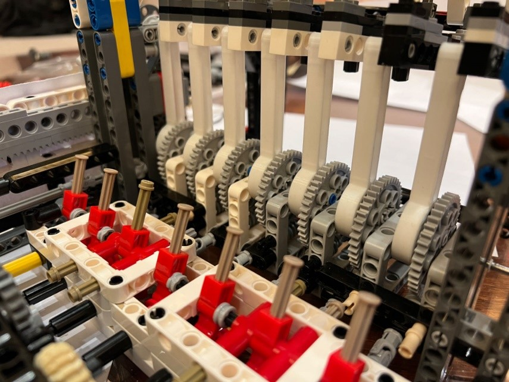
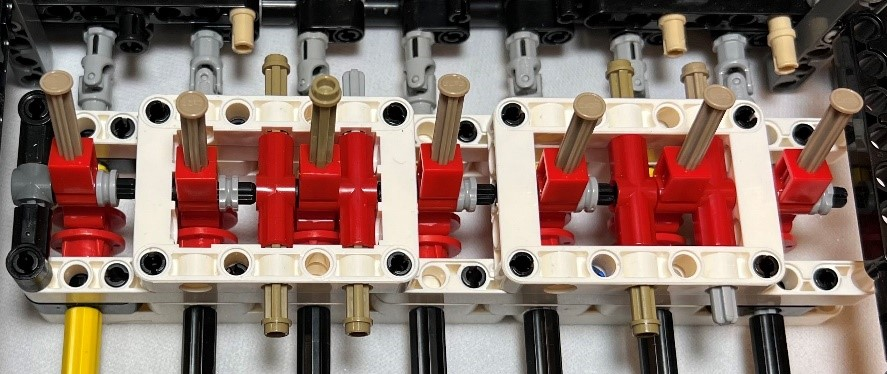

# LEGO Fourier Analyzer
A LEGO machine that can do Fourier Analysis

GitHub Link: (https://github.com/jadongao/fourier-analyzer)

<iframe width=320 height=220 src="https://www.youtube.com/embed/BzMKB4JAS-Q" frameborder="0" allowfullscreen></iframe>
<!--Video Link: https://youtu.be/BzMKB4JAS-Q-->
<!--
  
-->

# 1. Why did I make it? Because it’s so coool!
I was instantly attracted by the harmonic analyzer made by Albert Michelson the moment I saw it and decided to recreate it right then. With the aid of other LEGO lovers online and some other makers who’ve also tried the same thing, I built this 7-frequency Fourier Analyzer (I prefer this name over the “harmonic analyzer”). Aside from being cool, it was an excellent tool for demonstrating what Fourier Analysis is to others. 

# 2. Overview of the Analyzer
Simply put, the analyzer has to achieve two things: decompose and synthesize. Since the two have parallel math equations, I only need to consider synthesis. The motor and the gear set separate one frequency into seven. Each of these is then connected to an amplitude bar. Each bar is then connected with one spring. The linear spring forces add together at the summing bar, representing the total displacement shown on the resulting graph.

  

## Example
Taking Fourier synthesis (7 sinusoids element) as an example: 

<!-- -->

  

where $a_n$ is +1, -1, +1, -1, +1, -1, +1.

f(x)= sin(x)-sin(2x)+sin(3x)-sin(4x)+sin(5x)-sin(6x)+sin(7x)

Using this LEGO Fourier Analyzer, the output function graph is as follows (Test date: Aug. 10, 2023), which is very close to the graph drawn by the computer.

  

# 3. Structure of the Analyzer

  

Below is a brief introduction of every part:

### 3.1 Frequency Generator 

  

The frequency generator is a gearbox with seven output shafts of different frequencies. 

### 3.2 Sinusoid Generator
<!-- -->

  

The sinusoid generator has seven gears to move Rocker arms, converting the circular rotation generated by the frequency generator into sinusoidal motion. This combination of mechanical elements produces the seven different sinusoidal waves: sin(1x), sin(2x), sin(3x), sin(4x), sin(5x), sin(6x), and sin(7x).

### 3.3 Amplitude Bars

  

The amplitude of each sinusoidal component can be adjusted by modifying the connection position between the amplitude bar and the rock arm.

### 3.4 Summing Lever

  

The summing lever at the top of the machine adds together the weighted sinusoids. The result is: 

  

 
### 3.5 Platen and Plumb

  

The platen moves horizontally, and the plumb moves vertically. The pen tied to the plumb draws a function graph of the calculation result on the recording paper.

### 3.6 Clutch

  

The clutch disconnects the gearbox from the rest of the machine so I can manually set initial phases on the sinusoid generator.

  

## 4. Innovation and Problem-Solving
### 4.1 Frequency Generating Gear Box
The original design implements a very beautiful and intuitive set of gears but requires a large set of gears with different radiuses. Since I don’t have that many gears of various sizes, I implemented my own gear set that is more complicated but does the job of separating frequencies using only a few different gear sizes.

  

  
### 4.2 Sinusoid Generator’s Problem of Getting Stuck
1) The worm would always get stuck during operation. I solved this issue with a simple yet crucial solution: make the worm more loosely connected and the connecting rod more tightly installed. 

  

2) The gears and the connecting rod often shake due to the looseness of the rod. Hence, I replaced it with stainless-steel bearings and 3D-printed connectors.
<!---->

  
 

### 4.3 Clutch

  

The clutch is already mentioned, but it’s also an innovation. I needed to manipulate the initial phases, but the gears attached to the motor can’t move if the motor doesn’t move. I created this clutch so I can disconnect the gears from the motors. 

## 5. Reflection on the work
### 5.1 Learning by Doing
During the making, I became more and more familiar with the principles of Fourier analysis. I’ve tried explaining to my friends and online learners what Fourier analysis was at times before. Trust me when I say words lose power when explaining things like this. After using this machine in my explanations, I found it the perfect demonstration device. 
But aside from that, it’s more than exciting to see an actual graph drawn with all the complicated stuff going on inside! It works like magic. 
### 5.2 Communicate with the Masters of History
When making this machine, I also traced the history of Fourier Analysis. I had a chance to communicate with these masters during this production process, and I felt their imaginative ideas in the era without electronic computers.

  

 
## References
[1] Fourier Transformation: A LEGO Machine that does Math, youtube.com/@thoroughfareproduction, (https://www.youtube.com/watch?v=NaWyCitZFXI&t=515s)

[2] Albert Michelson's Harmonic Analyzer, Bill Hammack, (https://www.engineerguy.com/fourier/)

<!--
<table border="0">
 <tr>
    <td><b style="font-size:30px">Time</b></td>
    <td><b style="font-size:30px">Name</b></td>
    <td><b style="font-size:30px">Invention</b></td>
 </tr>
 <tr>
    <td>1807</td>
    <td>French mathematician and physicist Fourier </td>
    <td>He published a paper that used sine curves to describe temperature distribution: periodic functions can be represented by a series of cosines and sines.</td>
 </tr>
<tr>
    <td>1879</td>
    <td>Sir William Thomson (Lord Kelvin)</td>
    <td>He designed a 15 constituent sinusoids tide predicting machine (TPM). </td>
</tr>
<tr>
    <td>1898</td>
    <td>Physicist Albert Michelson (Nobel Prize Winner) </td>
    <td>He designed the Harmonic Analyzer that calculates with 20 sinusoids. </td>
</tr>
<tr>
    <td>November 12, 2014</td>
    <td>Professor Bill Hammack </td>
    <td>He uses videos and PDF books to introduce Albert Michelson's Harmonic Analyzer. </td>
</tr>
<tr>
    <td>August 19, 2021</td>
    <td>Youtuber @thoroughfareproduction </td>
    <td>They designed a wondrous LEGO contraption of gears, springs, levers, and wheels to perform Fourier analysis. </td>
</tr>
</table>
-->

