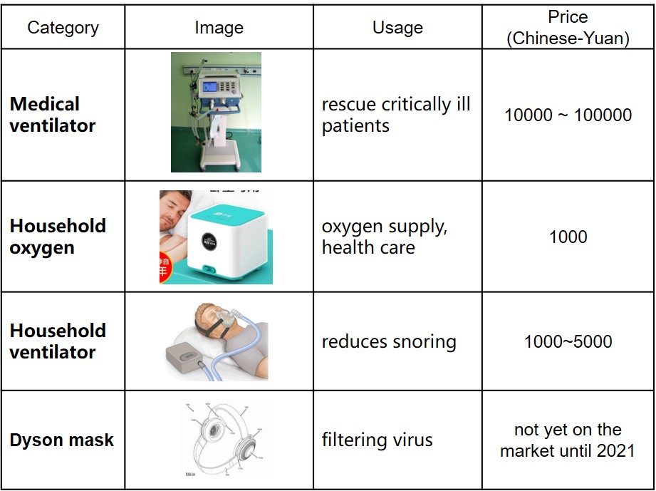

# A Low Resistance Mask with Fan
A low resistance mask with automatic opening and closing fan according to respiratory pressure

# 1.What kinds of things is this work?

Masks have become the most basic health protection barrier for people during the epidemic, but wearing masks for a long time often leads to difficulty breathing and a feeling of suffocation. The device designed in this project uses a fan to reduce the difference in air pressure between the inside and outside of the mask to improve the smoothness of inhalation, significantly improving the suction resistance of the mask while not affecting its original exhalation resistance. The device is small in size and can be carried around, powered by a power bank. All materials can be obtained from the market, and the cost is low, making it more suitable for ordinary people to use.

The low resistance mask with fan designed in this project reduces the suction pressure difference from 30Pa to 10Pa (with the fan continuously on) and 20Pa (with the fan automatically on and off), significantly improving the suction resistance of the mask. At the same time, by turning off the fan during exhalation, the exhalation resistance can be made equivalent to the original mask, that is, the exhalation resistance of the mask will not be changed.

# 2.How to characterize / categorize this work?

Mask, KN95, pressure difference, Respiratory Resistance

# 3.Briefly description of this work

The device designed in this project consists of three parts: a mask, an airtight box with a fan, and a microcontroller with a sensor. Please refer to the appendix for a detailed list of accessories and costs.

  

# 4.How do I make it?

## 4.1 Making Process
Step 1: Purchase a mask with an exhaust valve (1) from the pharmacy, remove the exhaust valve, and install the 3D printed air supply pipe connector (3-1).

  

Step 2: Install the turbine fan (5) into the 3D printed airtight box (4) and cover it with a filter (6). Connect the power cord of the fan to the battery (7), and connect the exhaust port of the fan to the air supply pipe connector (3-2).

  

  

Step 3: Connect the mask (1) and the airtight box (4) with a fan and filter using the air supply pipe (2). Turn on the power and the fan starts supplying air and pressurizing the mask.

  

Step 4: Keeping the fan on all the time makes the device very power consuming, so it is necessary to detect when it is inhaling and when it is exhaling to automatically control the switch. The solution is to add a micro pressure difference sensor (9) to sense the small pressure difference generated during breathing, and then use a microcontroller (10) to read the pressure difference. If it is a negative pressure value, it is judged as inhalation, and if it is a positive pressure value, it is judged as exhalation. Then, the relay (11) is used to control the switch of the fan.

  

## 4.2 Testing
Test case 1: Without turning on the fan, AS510 tests the pressure difference between the inside and outside of the mask during breathing.

  

The maximum expiratory pressure is about 40pa, and the minimum inspiratory pressure is about -30Pa

Test case 2: Turn on the fan, hold your breath, and test the pressure difference inside and outside the AS510 mask.

  

After the fan stabilizes, the pressure difference between the inside and outside of the mask remains basically at 40Pa.

Test case 3: Turn on the fan and AS510 tests the pressure difference between the inside and outside of the mask during breathing.

  

The maximum expiratory pressure difference is about 90Pa, and the minimum inspiratory pressure difference is about -10Pa.

It can be seen that the absolute value of the suction pressure difference in Test case 1 has been reduced by 20Pa, which significantly improves the suction resistance. But the absolute value of the exhalation pressure difference increased by 50Pa, and the exhalation resistance increased.

Test case 4: The Arduino microcontroller automatically switches on and off the fan during breathing, and AS510 tests the pressure difference between the inside and outside of the mask during breathing.

  

After controlling the fan, when exhaling, the fan was turned off. Compared to Test case 3 (with the fan on), the maximum pressure difference decreased from 90Pa to about 50Pa, and the exhalation resistance decreased, which was basically equivalent to Test case 1 (without the fan);

When inhaling, the fan was turned on, and compared to Test case 3 (with the fan on), the maximum absolute pressure difference increased from 10Pa to 20Pa. The breathing resistance increased, but it was still better than Test case 1 (without the fan). This indicates that the microcontroller control of the fan has not kept up with the rhythm of inhalation.

# 5.Why do I make it?

In 2021, the world is facing unprecedented COVID, and masks have become the most basic health protection barrier for people. Due to protective requirements, people need to ensure that the mask is tightly pressed against their face when wearing it, and the mask cannot be easily removed. When wearing a mask for a long time, they often feel difficulty breathing and suffocation. Especially for some medical staff, they need to provide long-term support for several hours, or even more than ten hours, within a day. Difficulty breathing can even lead to life-threatening situations. There have been reports of students running with high protective masks causing shock.

In many masks with good filtering performance (such as the KN95 mask), an exhaust valve is added to the front of the mask. When exhaling, the air is directly discharged through the valve without passing through the mask filter layer, which has almost no resistance and reduces the feeling of suffocation. This exhaust valve also proves that reducing pressure difference is the main method for assisting breathing. Of course, the exhaust valve will still close during inhalation due to its special design, and the resistance to inhalation has not decreased, which has not completely solved the problem of breathing difficulties when wearing a mask. This exhaust valve also inspired me to think about improving my mask, hoping to consider an assistive breathing device that can solve the inhalation problem.
I first checked the instruments used for assisted respiration. 1) Medical ventilators are expensive and require specialized medical personnel to operate them; 2) Household oxygen supply machines, with lower prices, are used for weak individuals to increase oxygen at home and have little to do with assisted breathing; 3) Household respirators, usually used to help snorers fall asleep, are more expensive. The most important thing is that these instruments need to be placed in a fixed position and cannot be used on the go. In addition, it was found that some specialized masks overseas, such as Dyson masks, have a transparent mask on the face, fans on both sides, and are fixed to the head with headbands. This specialized mask is still in the patent application stage and can only be used in professional fields, making it difficult for ordinary people to afford.

  

I hope to design a low resistance mask that can be carried around. Low cost, suitable for ordinary people rather than specific patients. The idea is to use a fan to filter (pressurize) the external air and squeeze it into the inside of the mask, reducing the pressure difference between the inside and outside of the mask to improve the smoothness of inhalation.

# 6.What's the most meaningful thing of this work?

The mask is of moderate size, making it possible to carry it with you; Using common materials in the market, with a total cost of less than 100 Chinese-Yuan; The battery uses a common 5V power bank, which is easy to obtain. So this mask is suitable for ordinary people to use.

I encountered several difficulties during the design process:

1. Can the fan reach inside the mask?
I originally tried fans with diameters of 12mm and 18mm, which were attached to the inside of the mask. However, I found that there was no significant change in the air pressure difference after turning on the fan.
There may be two possible reasons for this: 1) The fan size is small and the power is too low; 2) The fan cannot fit the inner layer of the mask and cannot suck in external air. This attempt rejected the direction of the built-in fan and identified a key principle: "Fan power should be high, and air tightness is also important", guiding subsequent design.

2. How to trigger the fan automatically?
The initial idea was to use a physical spring switch, but the force generated by breathing was too small to trigger the switch.  I disassemble the AS510 micro pressure measuring instrument I bought and found that it uses a micro differential pressure sensor internally. I searched online and found similar sensor, which is very cheap. This solves the problem of fan switch triggering by measuring the pressure difference between the inside and outside of the mask.

There are still many shortcomings in this mask, such as the automatic control judgment conditions being too simple, the mismatch between starting and stopping the fan and breathing rhythm. In addition, the size of the fan box is a bit larger. It is best to find a smaller and high-power fan that can be directly installed on the outside of the mask, eliminating the need for air supply pipes and making it more convenient to use.

# 7.Additional Information

## Measurement of Pressure Difference of Mask

  

The AS510 handheld micro pressure gauge (priced around 150 yuan on Taobao) has a measurement range of 0-100hPa and a measurement accuracy of ± 0.03hPa.

Measurement method:
1) Turn on the power of AS510 and reset it to zero
2) Insert a trachea of AS510 into the mask, close to the mouth and nose
3) Place the other trachea outside the mask
4) The display screen of AS510 shows the pressure difference between the inside and outside of the mask
