# 1.What kinds of things is this work?

Masks have become the most basic health protection barrier for people during the epidemic, but wearing masks for a long time often leads to difficulty breathing and a feeling of suffocation. The device designed in this project uses a fan to reduce the difference in air pressure between the inside and outside of the mask to improve the smoothness of inhalation, significantly improving the suction resistance of the mask while not affecting its original exhalation resistance. The device is small in size and can be carried around, powered by a power bank. All materials can be obtained from the market, and the cost is low, making it more suitable for ordinary people to use.

The device designed in this project reduces the suction pressure difference from 30Pa to 10Pa (with the fan continuously on) and 20Pa (with the fan automatically on and off), significantly improving the suction resistance of the mask. At the same time, by turning off the fan during exhalation, the exhalation resistance can be made equivalent to the original mask, that is, the exhalation resistance of the mask will not be changed.

# 2.How to characterize / categorize this work?

Mask, KN95, pressure difference, Respiratory Resistance

# 3.Briefly description of this work

The device designed in this project consists of three parts: a mask, an airtight box with a fan, and a microcontroller with a sensor. Please refer to the appendix for a detailed list of accessories and costs.

 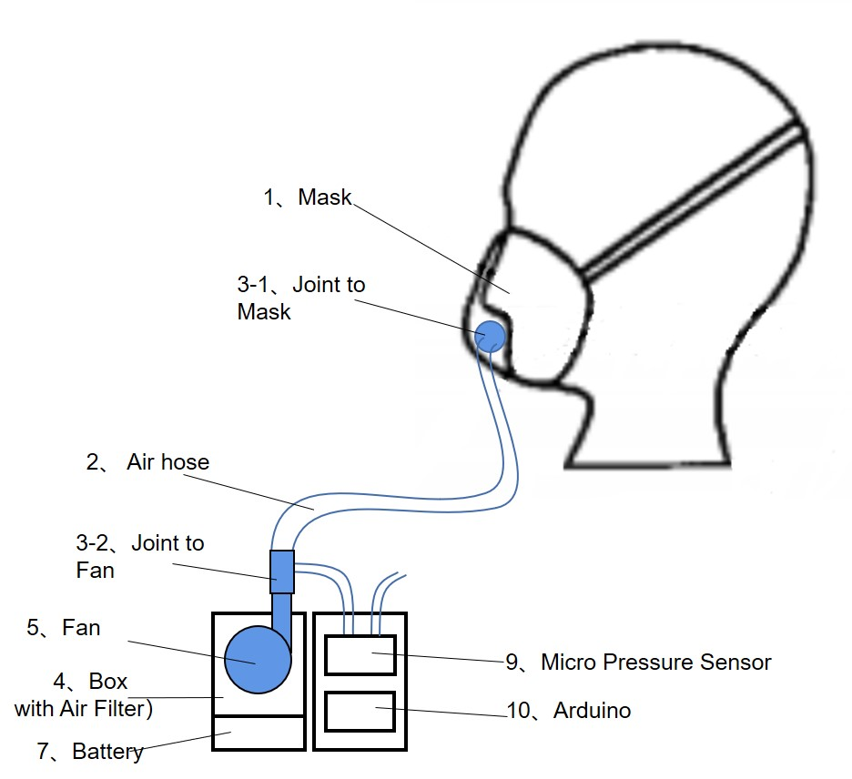 

# 4.How do I make it?

## 4.1 Making Process
Step 1: Purchase a mask with an exhaust valve (1) from the pharmacy, remove the exhaust valve, and install the 3D printed air supply pipe connector (3-1).

 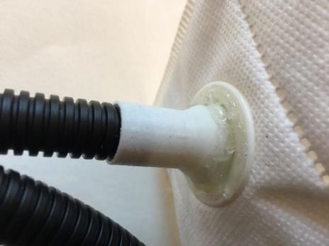 

Step 2: Install the turbine fan (5) into the 3D printed airtight box (4) and cover it with a filter (6). Connect the power cord of the fan to the battery (7), and connect the exhaust port of the fan to the air supply pipe connector (3-2).

 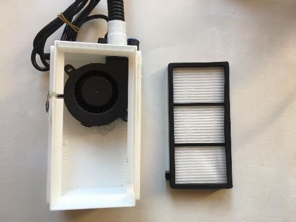 

 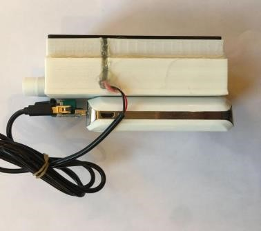 

Step 3: Connect the mask (1) and the airtight box (4) with a fan and filter using the air supply pipe (2). Turn on the power and the fan starts supplying air and pressurizing the mask.

 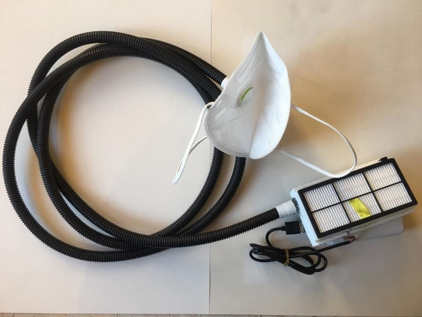 

Step 4: Keeping the fan on all the time makes the device very power consuming, so it is necessary to detect when it is inhaling and when it is exhaling to automatically control the switch. The solution is to add a micro pressure difference sensor (9) to sense the small pressure difference generated during breathing, and then use a microcontroller (10) to read the pressure difference. If it is a negative pressure value, it is judged as inhalation, and if it is a positive pressure value, it is judged as exhalation. Then, the relay (11) is used to control the switch of the fan.

 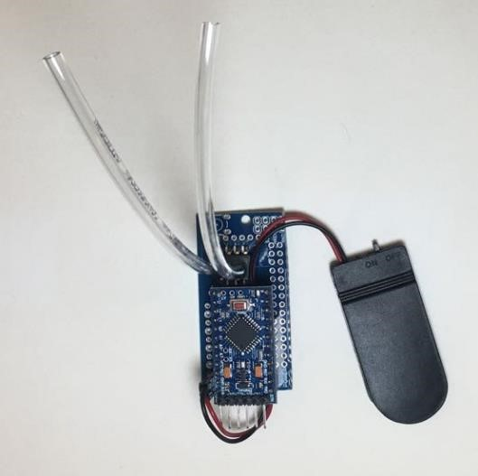 

## 4.2 Testing
Test case 1: Without turning on the fan, AS510 tests the pressure difference between the inside and outside of the mask during breathing.

 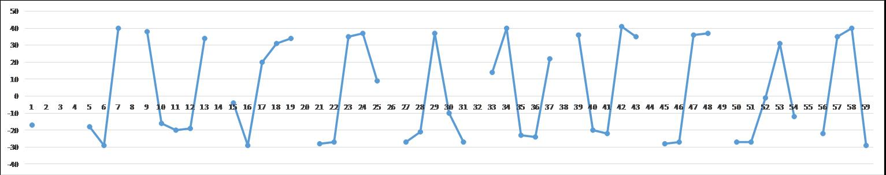 

The maximum expiratory pressure is about 40pa, and the minimum inspiratory pressure is about -30Pa

Test case 2: Turn on the fan, hold your breath, and test the pressure difference inside and outside the AS510 mask.

 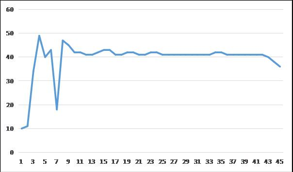 

After the fan stabilizes, the pressure difference between the inside and outside of the mask remains basically at 40Pa.

Test case 3: Turn on the fan and AS510 tests the pressure difference between the inside and outside of the mask during breathing.

 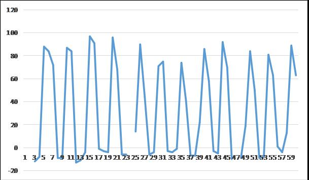> 

The maximum expiratory pressure difference is about 90Pa, and the minimum inspiratory pressure difference is about -10Pa.

It can be seen that the absolute value of the suction pressure difference in Test case 1 has been reduced by 20Pa, which significantly improves the suction resistance. But the absolute value of the exhalation pressure difference increased by 50Pa, and the exhalation resistance increased.

Test case 4: The Arduino microcontroller automatically switches on and off the fan during breathing, and AS510 tests the pressure difference between the inside and outside of the mask during breathing

 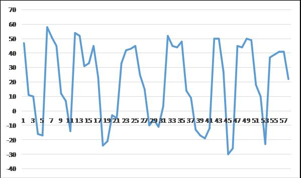> 

After controlling the fan, when exhaling, the fan was turned off. Compared to Test case 3 (with the fan on), the maximum pressure difference decreased from 90Pa to about 50Pa, and the exhalation resistance decreased, which was basically equivalent to Test case 1 (without the fan);

When inhaling, the fan was turned on, and compared to Test case 3 (with the fan on), the maximum absolute pressure difference increased from 10Pa to 20Pa. The breathing resistance increased, but it was still better than Test case 1 (without the fan). This indicates that the microcontroller control of the fan has not kept up with the rhythm of inhalation.

# 5.Why do I make it?

In 2021, the world is facing unprecedented COVID, and masks have become the most basic health protection barrier for people. Due to protective requirements, people need to ensure that the mask is tightly pressed against their face when wearing it, and the mask cannot be easily removed. When wearing a mask for a long time, they often feel difficulty breathing and suffocation. Especially for some medical staff, they need to provide long-term support for several hours, or even more than ten hours, within a day. Difficulty breathing can even lead to life-threatening situations. There have been reports of students running with high protective masks causing shock.

To solve the long-term comfort of mask matching, it is necessary to develop and analyze the structure of the mask. Masks are usually composed of multiple layers of filtering materials, and air can only enter after being filtered layer by layer, which is hindered by the filtering layer. The better the filtering performance of a mask, the greater the resistance to breathing.

Masks purchased from pharmacies usually indicate respiratory resistance, which is measured using professional instruments. In order to accurately determine the resistance of the mask in this project, the AS510 handheld micro pressure gauge was used to measure the pressure difference inside and outside the mask (specific measurement methods can be found in the appendix). For example, the KN95 mask has a pressure difference of+40Pa between the inside and outside of the mask when exhaling, and -40Pa between the inside and outside of the mask when inhaling. The professional KN99 mask was not tested in this project, and according to online data, the breathing pressure difference can reach 100-200Pa.

From the pressure difference data, it can be seen that the better the protective performance of the mask, the more difficult it will be to breathe. The direct way to relieve suffocation after wearing a mask is to reduce respiratory resistance and the pressure difference inside and outside the mask.

# 6.What's the most meaningful thing you've made?

# Additional Information

## Measurement of Pressure Difference of Mask

 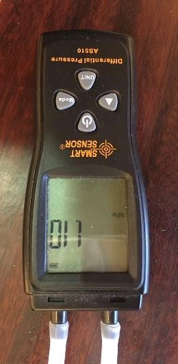 

The AS510 handheld micro pressure gauge (priced around 150 yuan on Taobao) has a measurement range of 0-100hPa and a measurement accuracy of ± 0.03hPa.

Measurement method:
1) Turn on the power of AS510 and reset it to zero
2) Insert a trachea of AS510 into the mask, close to the mouth and nose
3) Place the other trachea outside the mask
4) The display screen of AS510 shows the pressure difference between the inside and outside of the mask
